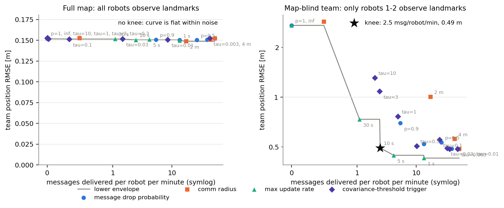

# coop-localization-comm-budget

How much inter-robot communication does cooperative localization actually
need, and which simple way of choosing the messages degrades least? Cooperative
localization lets a robot improve its pose estimate by observing a teammate and
fusing the teammate's communicated estimate, but every such fusion costs a
message. On the UTIAS MR.CLAM multi-robot datasets (five robots, real odometry,
camera range/bearing to landmarks and to each other, Vicon ground truth) this
repository constrains how often robots may use teammate messages, through
random loss, a communication radius, a rate limit and a covariance-threshold
trigger, and maps localization accuracy against the number of messages
delivered.

Random loss on this dataset has been swept before (Chang, Chen and Mehta 2022;
Luft et al. 2018). The contribution here is the comparison of policy families
at matched delivered-message rate, a map-blind split, the knee in delivered
messages, and a pipeline whose results reproduce byte for byte.

## Headline finding

With all 15 landmarks in view, teammate messages do not improve
localization: team position RMSE is 0.152 m with 53 messages per robot per
minute and 0.153 m with none, and every constrained setting lies within
0.149-0.153 m. When three of the five robots have no landmark access, teammate
messages cut their RMSE from 4.45 m to 0.72 m, and a budget of one teammate
update per robot per 10 s (2.5 messages per robot per minute, 4.6 % of the
available messages) recovers 99.7 % of that gain. At equal budgets, regularly
spaced updates beat random delivery, a short communication radius is the worst
way to spend the budget, and the simplest covariance-threshold trigger does not
beat the fixed schedule: at about 2.4 messages per robot per minute it gives
1.084 m against 0.492 m.



*Team position RMSE against teammate messages delivered per robot per minute,
pooling all four constraint families and averaged over MR.CLAM datasets 1-4.
Left: all robots observe landmarks. Right: robots 3-5 have no landmark access
and localize from odometry and teammate messages only. The star marks the
knee of the lower envelope.*

Full tables, all figures, findings and limitations: [docs/results.md](docs/results.md).

## Methods

* **Dead reckoning**: integrates the logged velocity commands from the
  ground-truth initial pose.
* **EKF with landmarks**: unicycle EKF fusing odometry with range/bearing to
  the 15 landmarks at their known positions.
* **Cooperative EKF**: the same filter run jointly for all five robots, which
  additionally fuses range/bearing to teammates using the teammate's current
  estimate as the observed point; the teammate's uncertainty is folded in with
  split covariance intersection so the decoupled filters stay consistent.
* **Communication constraints** on the cooperative EKF: message drop
  probability p in {0, 0.25, 0.5, 0.75, 0.9, 1}; comm radius on measured range
  in {1, 2, 4, 8 m, unlimited}; at most one teammate update per robot per
  {1, 5, 10, 30 s, never}; and a covariance-threshold trigger that fuses a
  teammate message only while the receiver's position-covariance trace exceeds
  tau in {0.003, 0.01, 0.03, 0.1, 0.3, 1, 3, 10} m^2 (a deliberately simple
  trigger, not a reimplementation of any published adaptive scheme). Every run
  logs the messages delivered.
* **Two regimes**: the standard full-map task, and a map-blind team in which
  only robots 1-2 see landmarks (added because, with 15 landmarks in view,
  cooperation has little left to improve).

Ground truth is used only for the initial pose and for scoring. Ground-truth
dropout windows (Vicon gaps longer than 0.5 s) are excluded from scoring.

## Results at a glance

Mean over MR.CLAM datasets 1-4; "messages" are teammate messages delivered.
Dead reckoning alone: 3.494-4.863 m per dataset.

| setting | messages per robot per minute | share of messages | team RMSE, full map [m] | team RMSE, map-blind team [m] |
|---|---|---|---|---|
| no messages (landmark EKF) | 0 | 0 % | 0.153 | 2.722 |
| one update per 30 s | 1.1 | 2.1 % | 0.152 | 0.735 |
| one update per 10 s (knee) | 2.5 | 4.6 % | 0.150 | 0.492 |
| one update per 5 s | 4.2 | 7.9 % | 0.151 | 0.445 |
| one update per 1 s | 13.5 | 25.5 % | 0.150 | 0.428 |
| trigger tau = 3 m^2 | 2.4 | 4.6 % | 0.152 | 1.084 |
| trigger tau = 1 m^2 | 4.9 | 9.4 % | 0.153 | 0.765 |
| trigger tau = 0.3 m^2 | 10.2 | 19.4 % | 0.152 | 0.505 |
| random loss p = 0.9 | 5.4 | 10.1 % | 0.151 | 0.696 |
| random loss p = 0.5 | 26.6 | 49.9 % | 0.150 | 0.533 |
| comm radius 2 m | 17.6 | 32.9 % | 0.149 | 1.003 |
| comm radius 4 m | 44.9 | 84.0 % | 0.151 | 0.558 |
| all messages | 53.2 | 100 % | 0.152 | 0.485 |

The first 500 s of dataset 9 (the window with barriers used by Chang, Chen and
Mehta 2022) were also run with the unchanged protocol. There the
fixed-parameter landmark EKF itself fails: its 99 % innovation gate rejects
most landmark updates under that window's faster turning, so those results are
reported in `docs/results.md` as a diagnosed failure with a gate check, not as
a comparable curve.

## Reproduce

```
pip install -r requirements.txt
python scripts/download_mrclam.py
python run_experiments.py
```

The third command runs all 408 filter runs (4 datasets x 2 regimes x
51 configurations) in about 21 minutes on 4 worker processes and writes
`results/*.csv`, `figures/*.{pdf,png}` and `results/tables.md`.
`python run_experiments.py --replot` regenerates the figures and tables from
the saved CSVs; `python -m unittest discover -s tests` runs 15 sanity tests on
a synthetic team (no data needed). The dataset-9 window:
`python scripts/download_mrclam.py 9`, then
`python run_experiments.py --datasets 9 --max-duration 500 --results results/dataset9_500s --figures figures/dataset9_500s`
and `python scripts/dataset9_gate_check.py`.

## Repository layout

```
scripts/download_mrclam.py        download + extract MR.CLAM datasets (FTP, stdlib only)
scripts/measurement_residuals.py  sensor-noise diagnostic against ground truth
scripts/dataset9_gate_check.py    gate-on/gate-off diagnosis of the dataset-9 failure
src/loader.py                     parse .dat files, map barcodes, resample to a 0.02 s grid, mask GT dropouts
src/localize.py                   dead reckoning, landmark EKF, cooperative EKF (covariance intersection)
src/comm.py                       drop / radius / rate / covariance-threshold-trigger policies
src/analysis.py                   sweep aggregation, knee detection, matched-budget pairing, markdown tables
src/plotting.py                   figures (PDF + PNG)
run_experiments.py                full protocol; --quick smoke test; --replot; --max-duration
tests/test_sanity.py              unit tests on a synthetic team
results/                          CSV outputs, tables.md, run_metadata.json (datasets 1-4); dataset9_500s/
figures/                          all figures (datasets 1-4); dataset9_500s/
docs/results.md                   write-up
```

## Data

`scripts/download_mrclam.py` fetches `MRCLAM1.zip` to `MRCLAM4.zip` (and
`MRCLAM9.zip` on request) from the official FTP server
`ftp://asrl3.utias.utoronto.ca/MRCLAM/` (the dataset page lists them as
"Dataset 1-9"; the files on the server are named `MRCLAM<N>.zip`, and dataset
4 extracts to a folder called `MRSLAM_Dataset4`). The download worked directly
over FTP; no mirror was needed. Data are not committed (`data/` is
git-ignored).

Dataset page: https://asrl.utias.utoronto.ca/datasets/mrclam/index.html

## Citation

If you use the data, cite the dataset paper:

> K. Y. K. Leung, Y. Halpern, T. D. Barfoot and H. H. T. Liu. "The UTIAS
> Multi-Robot Cooperative Localization and Mapping Dataset." International
> Journal of Robotics Research, 30(8):969-974, July 2011.

Covariance intersection for teammate fusion follows S. J. Julier and
J. K. Uhlmann, "A non-divergent estimation algorithm in the presence of
unknown correlations," American Control Conference, 1997, and "General
decentralized data fusion with covariance intersection (CI)," Multisensor Data
Fusion, CRC Press, 2001, and L. C. Carrillo-Arce, E. D. Nerurkar,
J. L. Gordillo and S. I. Roumeliotis, "Decentralized multi-robot cooperative
localization using covariance intersection," IROS 2013. Prior
communication-budget sweeps on this dataset: T.-K. Chang, K. Chen and
A. Mehta, IEEE Transactions on Robotics 38(1):197-208, 2022; L. Luft,
T. Schubert, S. I. Roumeliotis and W. Burgard, International Journal of
Robotics Research 37(10):1152-1167, 2018.

## License

MIT, see [LICENSE](LICENSE).
