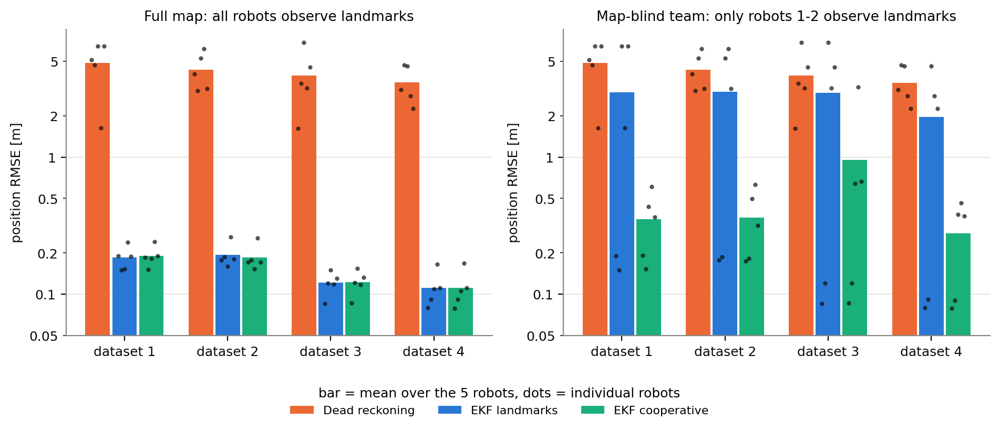
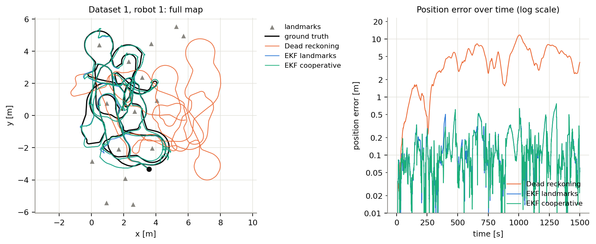
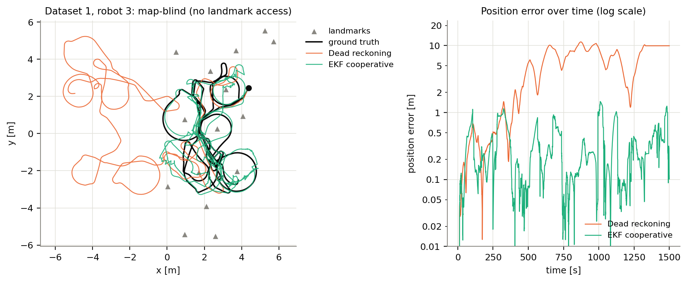
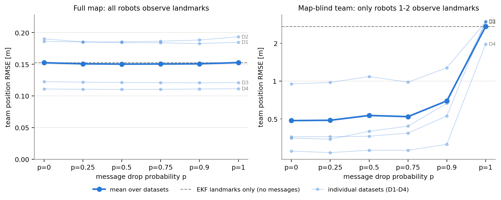
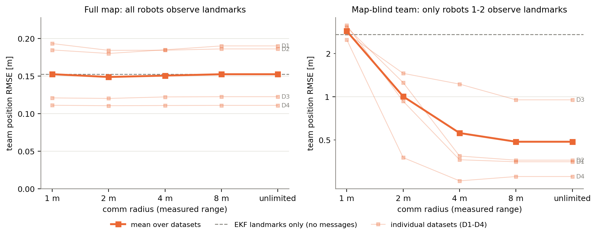
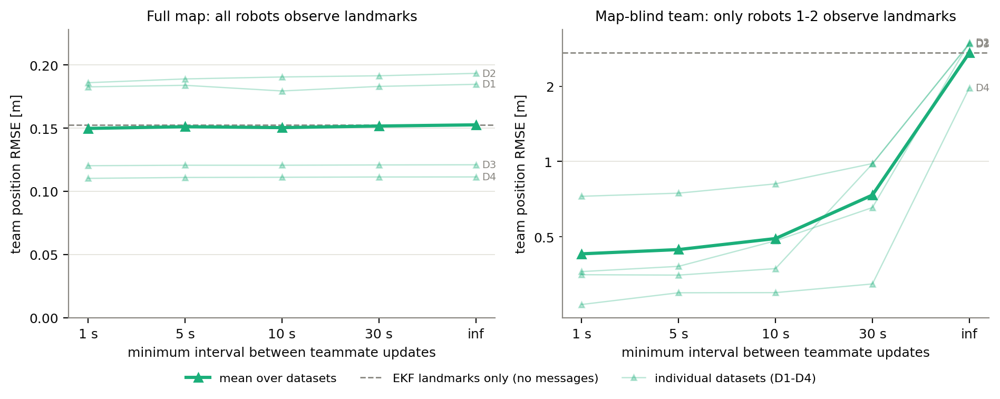

# How much inter-robot communication does cooperative localization need?

Results of constraining teammate message exchange in a cooperative EKF on the
UTIAS Multi-Robot Cooperative Localization and Mapping (MR.CLAM) datasets 1-4.
Every number and figure in this document was produced by `run_experiments.py`
in this repository; the raw per-run rows are in `results/*.csv`.

## 1. Research question

Cooperative localization lets a robot fuse range/bearing observations of a
teammate together with the teammate's own pose estimate, which has to be
communicated. Communication is the scarce resource in a multi-robot system, so
the question studied here is:

> On real multi-robot data, how does localization accuracy degrade as the
> number of teammate messages a robot may use is reduced, and where is the
> knee of that curve?

Three ways of reducing communication are compared because they remove
different messages: random loss removes messages uniformly, a comm radius
removes the long-range ones, and a rate limit removes the ones that arrive in
bursts.

## 2. Data

MR.CLAM (Leung et al., 2011) was recorded with five iRobot-Create-based robots
driving to random waypoints in a 15 m x 8 m room with 15 cylindrical landmarks.
Each robot logs velocity commands (odometry) at about 67-100 Hz and detects
barcodes on landmarks and other robots with a monocular camera, giving range
and bearing measurements. A Vicon system provides ground truth at about 100 Hz
with millimetre accuracy. Datasets 1-4 are used (durations 1500, 1861, 1800 and
1400 s on the common grid).

File layout, verified against the official page:

| file | columns |
|---|---|
| `Barcodes.dat` | subject #, barcode # |
| `Landmark_Groundtruth.dat` | subject #, x [m], y [m], x std-dev [m], y std-dev [m] |
| `Robot<N>_Groundtruth.dat` | time [s], x [m], y [m], orientation [rad] |
| `Robot<N>_Odometry.dat` | time [s], forward velocity [m/s], angular velocity [rad/s] |
| `Robot<N>_Measurement.dat` | time [s], barcode # of observed subject, range [m], bearing [rad] |

Robots are subjects 1-5 and landmarks are subjects 6-20. The measurement file
stores barcode numbers, which are mapped back to subjects through
`Barcodes.dat`; the mapping differs between datasets 1-2 and 3-4.

### 2.1 Preprocessing (`src/loader.py`)

* **Uniform grid.** All streams are resampled to a 0.02 s grid spanning the
  common ground-truth interval of the five robots. Odometry is zero-order held;
  a command older than 1.5 s is replaced by zero velocity (the logs contain
  occasional one-second gaps, and in dataset 3 robot 4's odometry stops 288 s
  before the end while the robot is stationary). Ground truth is linearly
  interpolated with the heading unwrapped first. Measurements are assigned to
  the nearest grid step.
* **Ground-truth dropout masking.** Gaps longer than 0.5 s between consecutive
  Vicon samples are treated as tracking dropouts and the grid points inside
  them are excluded from scoring. The only large dropout is 116.8 s for robot 3
  in dataset 3; all others are under 2 s. Masked seconds per robot are in the
  `gt_dropout_s` column below.
* **Unknown barcodes.** Measurements whose barcode is not listed in
  `Barcodes.dat` (3, 11, 16 and 9 rows in datasets 1-4) are dropped, as are
  the rare rows in which a robot reports seeing its own barcode.

### 2.2 Dataset summary

*Table 1. Per-robot summary of the resampled datasets. `odom_missing_s` counts grid seconds without a recent odometry command (replaced by zero velocity).*

| dataset | robot | duration_s | landmark_obs | robot_obs | robot_obs_per_min | robot_range_median_m | robot_range_max_m | gt_dropout_s | odom_missing_s |
|---|---|---|---|---|---|---|---|---|---|
| 1 | 1 | 1500 | 4771 | 952 | 38.08 | 2.51 | 6.45 | 0.9 | 9.5 |
| 1 | 2 | 1500 | 5543 | 1156 | 46.24 | 2.41 | 6.56 | 0 | 10.7 |
| 1 | 3 | 1500 | 6771 | 1969 | 78.76 | 3.49 | 7.43 | 0 | 12.2 |
| 1 | 4 | 1500 | 3269 | 722 | 28.88 | 2.32 | 5.81 | 1.4 | 9.4 |
| 1 | 5 | 1500 | 7137 | 1654 | 66.16 | 2.4 | 5.7 | 0 | 10.9 |
| 2 | 1 | 1861 | 6631 | 1884 | 60.73 | 2.41 | 6.03 | 0 | 5.9 |
| 2 | 2 | 1861 | 6049 | 1684 | 54.28 | 2.23 | 6.88 | 1.6 | 6.9 |
| 2 | 3 | 1861 | 8624 | 2108 | 67.95 | 2.29 | 5.87 | 0 | 7.8 |
| 2 | 4 | 1861 | 3956 | 1030 | 33.2 | 2.59 | 5.28 | 0.6 | 14.3 |
| 2 | 5 | 1861 | 11296 | 2087 | 67.27 | 2.61 | 7.05 | 0 | 8.6 |
| 3 | 1 | 1800 | 7011 | 1292 | 43.07 | 2.26 | 7.28 | 1.1 | 8.1 |
| 3 | 2 | 1800 | 6697 | 1427 | 47.57 | 2.26 | 7.05 | 0.6 | 9.3 |
| 3 | 3 | 1800 | 8855 | 1817 | 60.57 | 3 | 8.85 | 116.8 | 10.3 |
| 3 | 4 | 1800 | 2229 | 161 | 5.37 | 2.4 | 5.09 | 0.6 | 293.9 |
| 3 | 5 | 1800 | 10363 | 2196 | 73.2 | 2.58 | 8.95 | 0.6 | 5.3 |
| 4 | 1 | 1400 | 6728 | 1341 | 57.47 | 2.16 | 5.15 | 0.6 | 11.3 |
| 4 | 2 | 1400 | 5242 | 1135 | 48.64 | 2.07 | 7.62 | 0.6 | 10 |
| 4 | 3 | 1400 | 6443 | 1277 | 54.73 | 2.48 | 5.87 | 0.6 | 12.7 |
| 4 | 4 | 1400 | 4779 | 756 | 32.4 | 2.66 | 6.19 | 0.6 | 17 |
| 4 | 5 | 1400 | 9368 | 2336 | 100.11 | 2.36 | 6.79 | 0.6 | 12.5 |

`robot_obs` counts robot-to-robot observations, which are the candidate
messages for the cooperative filter: typically 30-80 per robot per minute
(extremes: 5.4 for robot 4 in dataset 3 and 100 for robot 5 in dataset 4) at
median ranges of 2.1-3.5 m.

## 3. Methods

### 3.1 Models

State per robot: x = [x, y, theta]. Unicycle motion with the logged commands
(v, w): x += v cos(theta) dt, y += v sin(theta) dt, theta += w dt. Range and
bearing to a point p: r = |p - (x, y)|, phi = atan2(p_y - y, p_x - x) - theta.
Odometry noise is specified as spectral densities (sigma_v = 0.05 m/s/sqrt(Hz),
sigma_w = 0.10 rad/s/sqrt(Hz), plus a small heading random walk of
0.002 rad/sqrt(s)), measurement noise as sigma_r = 0.15 m and
sigma_phi = 0.05 rad. Every update is gated at the 99 % chi-square level
(2 dof). These values were fixed a priori and are identical for every dataset,
regime and method.

### 3.2 Estimators (`src/localize.py`)

* **Dead reckoning.** Integrates odometry from the ground-truth initial pose.
* **EKF with landmarks.** Odometry prediction plus range/bearing updates to
  landmarks at their ground-truth positions (the known map).
* **Cooperative EKF.** The same filter, run jointly for the five robots. When
  robot i observes teammate j, j's *current estimate* is used as the observed
  point. Because the filters do not track cross-covariances between robots,
  the teammate information is fused with split covariance intersection
  (Julier and Uhlmann, 2001; used for cooperative localization by
  Carrillo-Arce et al., 2013): the receiver's prior covariance is scaled by
  1/omega and the teammate's position covariance by 1/(1 - omega), the
  independent sensor noise R is left unscaled, and omega is chosen from a grid
  (0.05 ... 0.95) to minimise the posterior trace. If no omega lowers the trace
  below the prior, the message is declined. Teammate states are snapshotted
  after the landmark updates of the step and before any robot-to-robot update,
  so results do not depend on robot ordering. A naive variant that simply adds
  the teammate covariance to R is kept as an ablation.

Ground truth is used only for the initial pose and for scoring.

### 3.3 Measurement noise diagnostic

The residuals of every measurement against ground truth (computed by
`scripts/measurement_residuals.py`, never used by the estimators) show that the
a-priori noise values are conservative: range noise is 0.07-0.18 m depending on
range, bearing noise is about 0.01 rad, and robot-to-robot ranges carry a
systematic +0.04 to +0.05 m bias because the barcode sits ahead of the robot's
tracked centre. Dataset 1 also contains about 13 % landmark outliers
(mis-detections), which is why the innovation gate matters.

*Table 2. Measurement residuals against ground truth (median bias, MAD-based standard deviation, inlier fraction with |range residual| < 1 m and |bearing residual| < 0.3 rad). Range bands are in `results/measurement_residuals.csv`.*

| dataset | kind | n | inlier_fraction | range_bias_m | range_std_m | bearing_bias_rad | bearing_std_rad |
|---|---|---|---|---|---|---|---|
| 1 | landmark | 27481 | 0.8664 | 0.0021 | 0.1239 | -0.0048 | 0.0097 |
| 1 | robot | 6449 | 0.9994 | 0.047 | 0.1018 | -0.0062 | 0.0089 |
| 2 | landmark | 36550 | 0.9995 | 0.0051 | 0.122 | -0.006 | 0.0102 |
| 2 | robot | 8791 | 0.9999 | 0.054 | 0.0918 | -0.006 | 0.0103 |
| 3 | landmark | 34004 | 0.9998 | 0.0193 | 0.1004 | -0.003 | 0.0105 |
| 3 | robot | 6546 | 0.9994 | 0.0429 | 0.1002 | -0.0026 | 0.0097 |
| 4 | landmark | 32550 | 0.9996 | 0.0144 | 0.1021 | -0.0033 | 0.012 |
| 4 | robot | 6838 | 0.9988 | 0.0479 | 0.0984 | -0.0046 | 0.0111 |

### 3.4 Communication constraints (`src/comm.py`)

A robot-to-robot observation can only be fused if the observed teammate's
state message is delivered. Three constraint families:

| family | settings | what it removes |
|---|---|---|
| message drop probability p | 0, 0.25, 0.5, 0.75, 0.9, 1.0 | messages at random (seeded; 5 seeds per setting) |
| comm radius on measured range | 1, 2, 4, 8 m, unlimited | long-range messages |
| max update rate | at most one teammate update per robot per 1, 5, 10, 30 s, never | bursts of messages (deterministic) |

**Message accounting.** For every run the number of candidate observations,
messages delivered, fused, gated (rejected by the innovation gate) and
declined (no usable information) is logged. "Messages" in all plots means
messages delivered, normalised per robot per minute so that datasets of
different length are comparable.

### 3.5 Regimes

* **Full map.** All five robots observe landmarks. This is the standard
  "cooperative localization with a known map" task of the dataset.
* **Map-blind team.** Only robots 1 and 2 fuse landmark measurements; robots
  3-5 are map-blind and localise from odometry and teammate messages only.
  This models a heterogeneous team in which only some robots have absolute
  positioning and is where communication is expected to matter most. It is an
  addition to the base protocol and is reported separately throughout.

### 3.6 Metrics

Position RMSE in metres against interpolated ground truth over all valid grid
points, per robot; "team RMSE" is the mean over the five robots. Heading RMSE,
median, 95th percentile and final error are also stored in the CSVs.

## 4. Experimental protocol

Per dataset and regime: one dead-reckoning pass and 43 cooperative-filter
runs (no messages, unconstrained with covariance intersection, unconstrained
with naive fusion, 6 drop probabilities x 5 seeds, 5 comm radii, 5 update
rates). That is 86 filter runs per dataset and 344 in total, each a joint
five-robot filter over 70,000-93,068 grid steps at dt = 0.02 s. The four
datasets run in parallel worker processes; one dataset takes 11-14 minutes and
the whole protocol 13.5 minutes of wall time on a 16-core laptop
(`results/run_metadata.json` records the exact timings, versions and
parameters of the run that produced the committed results). The run was
executed twice from scratch and produced byte-identical CSVs.

Filter parameters (fixed a priori, `src/localize.py: NoiseParams`):

| parameter | value |
|---|---|
| sigma_v (forward velocity noise density) | 0.05 m/s/sqrt(Hz) |
| sigma_w (angular velocity noise density) | 0.10 rad/s/sqrt(Hz) |
| heading random walk when stationary | 0.002 rad/sqrt(s) |
| sigma_r (range) | 0.15 m |
| sigma_phi (bearing) | 0.05 rad |
| innovation gate | chi-square 2 dof, 99 % (9.21) |
| initial covariance | (0.05 m)^2, (0.05 m)^2, (0.05 rad)^2 |
| CI omega grid | 0.05, 0.10, ..., 0.95 |

## 5. Results

### 5.1 Base methods



*Figure 1. Team position RMSE (bars: mean over the five robots; dots:
individual robots) for dead reckoning, the landmark EKF and the unconstrained
cooperative EKF, per dataset. Left: full map. Right: map-blind team.*

*Table 3. Team position RMSE [m] (mean over the five robots) and heading RMSE [rad] of the base methods. The cooperative EKF uses unconstrained communication.*

| regime | dataset | Dead reckoning | EKF landmarks | EKF cooperative |
|---|---|---|---|---|
| full_map | 1 | 4.863 | 0.185 | 0.19 |
| full_map | 2 | 4.332 | 0.193 | 0.186 |
| full_map | 3 | 3.929 | 0.121 | 0.122 |
| full_map | 4 | 3.494 | 0.111 | 0.111 |
| map_blind | 1 | 4.863 | 2.97 | 0.352 |
| map_blind | 2 | 4.332 | 2.992 | 0.361 |
| map_blind | 3 | 3.929 | 2.956 | 0.95 |
| map_blind | 4 | 3.494 | 1.97 | 0.277 |

| regime | dataset | Dead reckoning | EKF landmarks | EKF cooperative |
|---|---|---|---|---|
| full_map | 1 | 1.364 | 0.099 | 0.098 |
| full_map | 2 | 1.538 | 0.104 | 0.099 |
| full_map | 3 | 1.423 | 0.082 | 0.082 |
| full_map | 4 | 1.325 | 0.067 | 0.066 |
| map_blind | 1 | 1.364 | 0.739 | 0.231 |
| map_blind | 2 | 1.538 | 1.012 | 0.178 |
| map_blind | 3 | 1.423 | 0.985 | 0.371 |
| map_blind | 4 | 1.325 | 0.745 | 0.173 |

*Table 4. Per-robot position RMSE [m]. `blind` marks robots without landmark access in the map-blind regime; for them the landmark EKF reduces to dead reckoning.*

| regime | dataset | robot | blind | Dead reckoning | EKF landmarks | EKF cooperative |
|---|---|---|---|---|---|---|
| full_map | 1 | 1 | False | 5.131 | 0.191 | 0.186 |
| full_map | 1 | 2 | False | 4.677 | 0.15 | 0.151 |
| full_map | 1 | 3 | False | 6.455 | 0.153 | 0.182 |
| full_map | 1 | 4 | False | 1.629 | 0.24 | 0.242 |
| full_map | 1 | 5 | False | 6.425 | 0.189 | 0.19 |
| full_map | 2 | 1 | False | 4.027 | 0.178 | 0.172 |
| full_map | 2 | 2 | False | 3.039 | 0.188 | 0.177 |
| full_map | 2 | 3 | False | 5.269 | 0.16 | 0.153 |
| full_map | 2 | 4 | False | 6.162 | 0.262 | 0.257 |
| full_map | 2 | 5 | False | 3.165 | 0.18 | 0.172 |
| full_map | 3 | 1 | False | 1.622 | 0.085 | 0.086 |
| full_map | 3 | 2 | False | 3.453 | 0.12 | 0.121 |
| full_map | 3 | 3 | False | 6.832 | 0.151 | 0.155 |
| full_map | 3 | 4 | False | 3.194 | 0.119 | 0.118 |
| full_map | 3 | 5 | False | 4.546 | 0.13 | 0.133 |
| full_map | 4 | 1 | False | 3.102 | 0.08 | 0.079 |
| full_map | 4 | 2 | False | 4.689 | 0.092 | 0.091 |
| full_map | 4 | 3 | False | 4.617 | 0.109 | 0.105 |
| full_map | 4 | 4 | False | 2.794 | 0.166 | 0.168 |
| full_map | 4 | 5 | False | 2.267 | 0.111 | 0.111 |
| map_blind | 1 | 1 | False | 5.131 | 0.191 | 0.193 |
| map_blind | 1 | 2 | False | 4.677 | 0.15 | 0.153 |
| map_blind | 1 | 3 | True | 6.455 | 6.455 | 0.437 |
| map_blind | 1 | 4 | True | 1.629 | 1.629 | 0.61 |
| map_blind | 1 | 5 | True | 6.425 | 6.425 | 0.366 |
| map_blind | 2 | 1 | False | 4.027 | 0.178 | 0.174 |
| map_blind | 2 | 2 | False | 3.039 | 0.188 | 0.182 |
| map_blind | 2 | 3 | True | 5.269 | 5.269 | 0.497 |
| map_blind | 2 | 4 | True | 6.162 | 6.162 | 0.633 |
| map_blind | 2 | 5 | True | 3.165 | 3.165 | 0.317 |
| map_blind | 3 | 1 | False | 1.622 | 0.085 | 0.086 |
| map_blind | 3 | 2 | False | 3.453 | 0.12 | 0.121 |
| map_blind | 3 | 3 | True | 6.832 | 6.832 | 0.643 |
| map_blind | 3 | 4 | True | 3.194 | 3.194 | 3.237 |
| map_blind | 3 | 5 | True | 4.546 | 4.546 | 0.665 |
| map_blind | 4 | 1 | False | 3.102 | 0.08 | 0.079 |
| map_blind | 4 | 2 | False | 4.689 | 0.092 | 0.09 |
| map_blind | 4 | 3 | True | 4.617 | 4.617 | 0.382 |
| map_blind | 4 | 4 | True | 2.794 | 2.794 | 0.463 |
| map_blind | 4 | 5 | True | 2.267 | 2.267 | 0.373 |



*Figure 2. Dataset 1, robot 1 with the full map: ground truth versus the three
estimates (left) and position error over time (right).*



*Figure 3. Dataset 1, robot 3 as a map-blind robot: dead reckoning (which is
also what the landmark EKF reduces to without landmark access) versus the
cooperative EKF with unconstrained communication.*

### 5.2 Fusion ablation

*Table 5. Split covariance intersection versus naive noise inflation for teammate fusion, unconstrained communication. `fused`, `gated` and `declined` count delivered messages by outcome.*

| regime | dataset | method | rmse_xy | rmse_xy_max_robot | fused | gated | declined |
|---|---|---|---|---|---|---|---|
| full_map | 1 | EKF cooperative (naive) | 0.182 | 0.237 | 6385 | 68 | 0 |
| full_map | 1 | EKF cooperative (CI) | 0.19 | 0.242 | 2832 | 4 | 3617 |
| map_blind | 1 | EKF cooperative (naive) | 0.487 | 0.931 | 6196 | 257 | 0 |
| map_blind | 1 | EKF cooperative (CI) | 0.352 | 0.61 | 1999 | 1 | 4453 |
| full_map | 2 | EKF cooperative (naive) | 0.173 | 0.204 | 8709 | 84 | 0 |
| full_map | 2 | EKF cooperative (CI) | 0.186 | 0.257 | 3594 | 1 | 5198 |
| map_blind | 2 | EKF cooperative (naive) | 0.499 | 0.789 | 8627 | 166 | 0 |
| map_blind | 2 | EKF cooperative (CI) | 0.361 | 0.633 | 2448 | 1 | 6344 |
| full_map | 3 | EKF cooperative (naive) | 0.121 | 0.15 | 6866 | 27 | 0 |
| full_map | 3 | EKF cooperative (CI) | 0.122 | 0.155 | 2928 | 1 | 3964 |
| map_blind | 3 | EKF cooperative (naive) | 1.239 | 3.019 | 5979 | 914 | 0 |
| map_blind | 3 | EKF cooperative (CI) | 0.95 | 3.237 | 2098 | 8 | 4787 |
| full_map | 4 | EKF cooperative (naive) | 0.109 | 0.168 | 6829 | 16 | 0 |
| full_map | 4 | EKF cooperative (CI) | 0.111 | 0.168 | 2824 | 3 | 4018 |
| map_blind | 4 | EKF cooperative (naive) | 0.239 | 0.363 | 6797 | 48 | 0 |
| map_blind | 4 | EKF cooperative (CI) | 0.277 | 0.463 | 2503 | 8 | 4334 |

### 5.3 Accuracy versus each communication constraint



*Figure 4. Team RMSE versus message drop probability. Faint lines: individual
datasets; bold line: mean over datasets; dashed: landmark EKF without
messages.*

*Table 6. Drop-probability sweep: mean over datasets (5 seeds each) and per dataset. `messages_per_robot_min` are messages delivered; `rmse_xy_blind` is the mean over map-blind robots only.*

| regime | setting | messages_per_robot_min | message_fraction | rmse_xy | rmse_xy_std_datasets | rmse_xy_blind | rmse_theta |
|---|---|---|---|---|---|---|---|
| full_map | p=0 | 53.234 | 1 | 0.152 | 0.042 |  | 0.086 |
| full_map | p=0.25 | 39.775 | 0.747 | 0.151 | 0.04 |  | 0.086 |
| full_map | p=0.5 | 26.572 | 0.499 | 0.15 | 0.04 |  | 0.086 |
| full_map | p=0.75 | 13.447 | 0.253 | 0.15 | 0.04 |  | 0.087 |
| full_map | p=0.9 | 5.395 | 0.101 | 0.151 | 0.041 |  | 0.087 |
| full_map | p=1 | 0 | 0 | 0.153 | 0.042 |  | 0.088 |
| map_blind | p=0 | 53.234 | 1 | 0.485 | 0.312 | 0.719 | 0.238 |
| map_blind | p=0.25 | 39.775 | 0.747 | 0.488 | 0.328 | 0.724 | 0.242 |
| map_blind | p=0.5 | 26.572 | 0.499 | 0.533 | 0.372 | 0.798 | 0.266 |
| map_blind | p=0.75 | 13.447 | 0.253 | 0.521 | 0.313 | 0.779 | 0.268 |
| map_blind | p=0.9 | 5.395 | 0.101 | 0.696 | 0.413 | 1.07 | 0.333 |
| map_blind | p=1 | 0 | 0 | 2.722 | 0.502 | 4.446 | 0.87 |

Per dataset (team position RMSE [m]):

| regime | setting | dataset 1 | dataset 2 | dataset 3 | dataset 4 |
|---|---|---|---|---|---|
| full_map | p=0 | 0.19 | 0.186 | 0.122 | 0.111 |
| full_map | p=0.25 | 0.185 | 0.185 | 0.122 | 0.11 |
| full_map | p=0.5 | 0.184 | 0.185 | 0.121 | 0.11 |
| full_map | p=0.75 | 0.184 | 0.186 | 0.121 | 0.11 |
| full_map | p=0.9 | 0.183 | 0.188 | 0.121 | 0.111 |
| full_map | p=1 | 0.185 | 0.193 | 0.121 | 0.111 |
| map_blind | p=0 | 0.352 | 0.361 | 0.95 | 0.277 |
| map_blind | p=0.25 | 0.345 | 0.361 | 0.976 | 0.27 |
| map_blind | p=0.5 | 0.399 | 0.364 | 1.087 | 0.282 |
| map_blind | p=0.75 | 0.438 | 0.386 | 0.981 | 0.281 |
| map_blind | p=0.9 | 0.666 | 0.528 | 1.277 | 0.314 |
| map_blind | p=1 | 2.97 | 2.992 | 2.956 | 1.97 |



*Figure 5. Team RMSE versus comm radius applied to the measured range.*

*Table 7. Comm-radius sweep.*

| regime | setting | messages_per_robot_min | message_fraction | rmse_xy | rmse_xy_std_datasets | rmse_xy_blind | rmse_theta |
|---|---|---|---|---|---|---|---|
| full_map | 1 m | 0.493 | 0.009 | 0.153 | 0.042 |  | 0.088 |
| full_map | 2 m | 17.556 | 0.329 | 0.149 | 0.039 |  | 0.086 |
| full_map | 4 m | 44.875 | 0.84 | 0.151 | 0.04 |  | 0.086 |
| full_map | 8 m | 53.216 | 1 | 0.152 | 0.042 |  | 0.086 |
| full_map | unlimited | 53.234 | 1 | 0.152 | 0.042 |  | 0.086 |
| map_blind | 1 m | 0.493 | 0.009 | 2.864 | 0.295 | 4.683 | 0.96 |
| map_blind | 2 m | 17.556 | 0.329 | 1.003 | 0.471 | 1.582 | 0.5 |
| map_blind | 4 m | 44.875 | 0.84 | 0.558 | 0.447 | 0.84 | 0.291 |
| map_blind | 8 m | 53.216 | 1 | 0.485 | 0.312 | 0.719 | 0.238 |
| map_blind | unlimited | 53.234 | 1 | 0.485 | 0.312 | 0.719 | 0.238 |

Per dataset (team position RMSE [m]):

| regime | setting | dataset 1 | dataset 2 | dataset 3 | dataset 4 |
|---|---|---|---|---|---|
| full_map | 1 m | 0.185 | 0.193 | 0.121 | 0.111 |
| full_map | 2 m | 0.18 | 0.184 | 0.12 | 0.111 |
| full_map | 4 m | 0.185 | 0.184 | 0.122 | 0.111 |
| full_map | 8 m | 0.19 | 0.186 | 0.122 | 0.111 |
| full_map | unlimited | 0.19 | 0.186 | 0.122 | 0.111 |
| map_blind | 1 m | 3.149 | 3.05 | 2.76 | 2.498 |
| map_blind | 2 m | 0.929 | 1.254 | 1.454 | 0.376 |
| map_blind | 4 m | 0.363 | 0.386 | 1.224 | 0.259 |
| map_blind | 8 m | 0.352 | 0.361 | 0.95 | 0.277 |
| map_blind | unlimited | 0.352 | 0.361 | 0.95 | 0.277 |



*Figure 6. Team RMSE versus the minimum interval between teammate updates
(one teammate fusion per robot per interval).*

*Table 8. Update-rate sweep.*

| regime | setting | messages_per_robot_min | message_fraction | rmse_xy | rmse_xy_std_datasets | rmse_xy_blind | rmse_theta |
|---|---|---|---|---|---|---|---|
| full_map | 1 s | 13.48 | 0.255 | 0.15 | 0.04 |  | 0.086 |
| full_map | 5 s | 4.17 | 0.079 | 0.151 | 0.041 |  | 0.087 |
| full_map | 10 s | 2.455 | 0.046 | 0.15 | 0.04 |  | 0.086 |
| full_map | 30 s | 1.096 | 0.021 | 0.152 | 0.041 |  | 0.087 |
| full_map | inf | 0 | 0 | 0.153 | 0.042 |  | 0.088 |
| map_blind | 1 s | 13.48 | 0.255 | 0.428 | 0.204 | 0.623 | 0.229 |
| map_blind | 5 s | 4.17 | 0.079 | 0.445 | 0.205 | 0.651 | 0.243 |
| map_blind | 10 s | 2.455 | 0.046 | 0.492 | 0.227 | 0.73 | 0.255 |
| map_blind | 30 s | 1.096 | 0.021 | 0.735 | 0.314 | 1.134 | 0.345 |
| map_blind | inf | 0 | 0 | 2.722 | 0.502 | 4.446 | 0.87 |

Per dataset (team position RMSE [m]):

| regime | setting | dataset 1 | dataset 2 | dataset 3 | dataset 4 |
|---|---|---|---|---|---|
| full_map | 1 s | 0.183 | 0.186 | 0.12 | 0.11 |
| full_map | 5 s | 0.184 | 0.189 | 0.121 | 0.111 |
| full_map | 10 s | 0.179 | 0.191 | 0.121 | 0.111 |
| full_map | 30 s | 0.183 | 0.192 | 0.121 | 0.111 |
| full_map | inf | 0.185 | 0.193 | 0.121 | 0.111 |
| map_blind | 1 s | 0.353 | 0.363 | 0.726 | 0.268 |
| map_blind | 5 s | 0.351 | 0.381 | 0.747 | 0.299 |
| map_blind | 10 s | 0.373 | 0.482 | 0.814 | 0.299 |
| map_blind | 30 s | 0.978 | 0.655 | 0.982 | 0.324 |
| map_blind | inf | 2.97 | 2.992 | 2.956 | 1.97 |

### 5.4 Accuracy versus messages used


*Figure 7. Team RMSE against messages delivered per robot per minute, pooling
all three constraint families (mean over datasets). The grey line is the lower
envelope; the star marks its knee (largest distance below the chord between
the end points in normalised coordinates).*

*Table 9. Knee of the pooled accuracy-versus-messages curve per regime. `fraction_of_gain` is the share of the no-comm to full-comm RMSE reduction achieved at the knee. In the full-map regime the envelope drops by less than 5 %, so no knee is reported.*

| knee_found | regime | rmse_xy_full_comm | rmse_xy_no_comm | messages_per_robot_min_full_comm | family | setting | messages_per_robot_min | rmse_xy | message_fraction | fraction_of_gain |
|---|---|---|---|---|---|---|---|---|---|---|
| False | full_map | 0.152 | 0.153 | 53.234 |  |  |  |  |  |  |
| True | map_blind | 0.485 | 2.722 | 53.234 | rate | 10 s | 2.455 | 0.492 | 0.046 | 0.997 |

## 6. Findings

1. **With the full landmark map, teammate messages are worthless.** Unconstrained
   cooperation (53 messages per robot per minute) gives a team RMSE of 0.152 m
   against 0.153 m with no messages at all, and all 16 constrained settings lie
   within 0.149-0.153 m (Figures 4-7, left panels). Per dataset the landmark
   EKF already reaches 0.111-0.193 m, close to the sensor floor set by the
   0.07-0.18 m range noise, and covariance intersection declines 56-59 % of the
   delivered messages as carrying no information the receiver does not already
   have. In the standard known-map task the answer to the research question is
   zero.

2. **Without map access, messages are what localizes a robot.** For the three
   map-blind robots the position RMSE falls from 4.45 m with odometry only to
   0.72 m with unconstrained messaging (team RMSE 2.72 m to 0.485 m, heading
   RMSE 0.87 rad to 0.24 rad). Eleven of the twelve blind robot-dataset cases
   end between 0.32 m and 0.67 m; the exception is robot 4 in dataset 3
   (3.24 m), which observes a teammate only 5.4 times per minute and whose
   odometry log stops about 290 s before the end. No communication budget can
   help a robot that rarely sees a teammate: observation opportunities, not
   bandwidth, are its binding constraint.

3. **The knee is at about 2.5 messages per robot per minute.** Limiting each
   robot to one teammate update per 10 s delivers 4.6 % of the available
   messages and yields 0.492 m team RMSE, 99.7 % of the gain of unconstrained
   messaging (Figure 7, right). One update per 5 s (7.9 % of messages) gives
   0.445 m and one per second (26 %) 0.428 m, both *better* than fusing every
   message (0.485 m): consecutive observations of the same teammate are
   strongly correlated and each CI update has to inflate the receiver's own
   prior, so beyond roughly one update per second extra messages add noise
   rather than information. Below one update per 30 s (1.1 messages per robot
   per minute) the error rises to 0.735 m, and with no messages to 2.72 m.

4. **How the budget is spent matters as much as its size.** At matched
   budgets, regularly spaced updates beat random delivery: about 13.5
   messages per robot per minute give 0.428 m with a rate limit but 0.521 m
   with random loss (p = 0.75); about 5 per minute give 0.445 m (one per 5 s)
   against 0.696 m (p = 0.9). A communication radius is the worst way to spend
   the budget: a 2 m radius still delivers 17.6 messages per robot per minute
   (33 %) yet produces 1.00 m, and a 4 m radius (84 % of messages) still costs
   0.558 m against 0.485 m, because range gating removes exactly the
   observations of distant anchored teammates that map-blind robots depend on
   (median robot-to-robot range is 2.1-3.5 m).

5. **Consistent fusion is a prerequisite for the result.** The naive
   cooperative EKF, which only adds the teammate covariance to the sensor
   noise, is worse than covariance intersection in three of the four
   map-blind datasets (0.487 vs 0.352, 0.499 vs 0.361 and 1.239 vs 0.950 m;
   dataset 4: 0.239 vs 0.277 m), and its innovation gate rejects 48-914
   messages per run against at most 8 for CI, the signature of over-confident
   covariances (Section 5.2). In the full-map regime the naive filter is
   marginally better (by 0.001-0.013 m) because landmark updates dominate and
   consistency is never at stake.

In short: cooperative localization needs very little communication, but what
it needs is a steady trickle of updates from well-localized teammates. On this
data one message per robot every 10 s is enough; what is harmful is cutting
off long-range exchanges, not cutting the message rate.

## 7. Limitations

* **Decoupled filters.** Cross-covariances between robots are not tracked;
  covariance intersection keeps the estimates consistent at the cost of some
  optimality, and this cost is visible in the full-map regime. A centralised
  or properly correlated filter would be the natural upper bound.
* **Message model.** A message is counted per robot-to-robot observation and
  is assumed to arrive instantly and losslessly once the constraint admits it;
  bandwidth, latency and packet size are not modelled. Only the observer's
  estimate is updated; the observed robot learns nothing from being seen.
* **Fixed tuning.** Noise parameters were set once, a priori, and are
  conservative relative to the measured residuals. The +4 to +5 cm range bias
  of robot observations and the range-dependent noise are not modelled; both
  affect every method equally.
* **Scope of the data.** Four datasets from one room, one sensor type and
  one robot platform; robots move slowly (at most 0.09 m/s). Datasets 5-9 and
  the occluded dataset 9 were not run.
* **Map-blind split.** The choice of robots 1-2 as anchors is fixed and
  arbitrary; the per-robot tables show that results for map-blind robots
  depend strongly on how often they see an anchored teammate.
* **Ground-truth dropouts.** Scoring excludes dropout windows, so a robot that
  drifts during a dropout is penalised only after tracking resumes.

## 8. Reproduction

```
python scripts/download_mrclam.py
python run_experiments.py
python -m unittest discover -s tests
```

`python run_experiments.py --replot` regenerates every figure and table from
the saved CSVs without rerunning the filters.

## 9. References

* K. Y. K. Leung, Y. Halpern, T. D. Barfoot and H. H. T. Liu, "The UTIAS
  Multi-Robot Cooperative Localization and Mapping Dataset," International
  Journal of Robotics Research, 30(8):969-974, 2011.
* S. J. Julier and J. K. Uhlmann, "General decentralized data fusion with
  covariance intersection (CI)," in Handbook of Multisensor Data Fusion
  (D. L. Hall and J. Llinas, eds.), chapter 12, CRC Press, 2001.
* L. C. Carrillo-Arce, E. D. Nerurkar, J. L. Gordillo and S. I. Roumeliotis,
  "Decentralized multi-robot cooperative localization using covariance
  intersection," IEEE/RSJ International Conference on Intelligent Robots and
  Systems (IROS), 2013.
